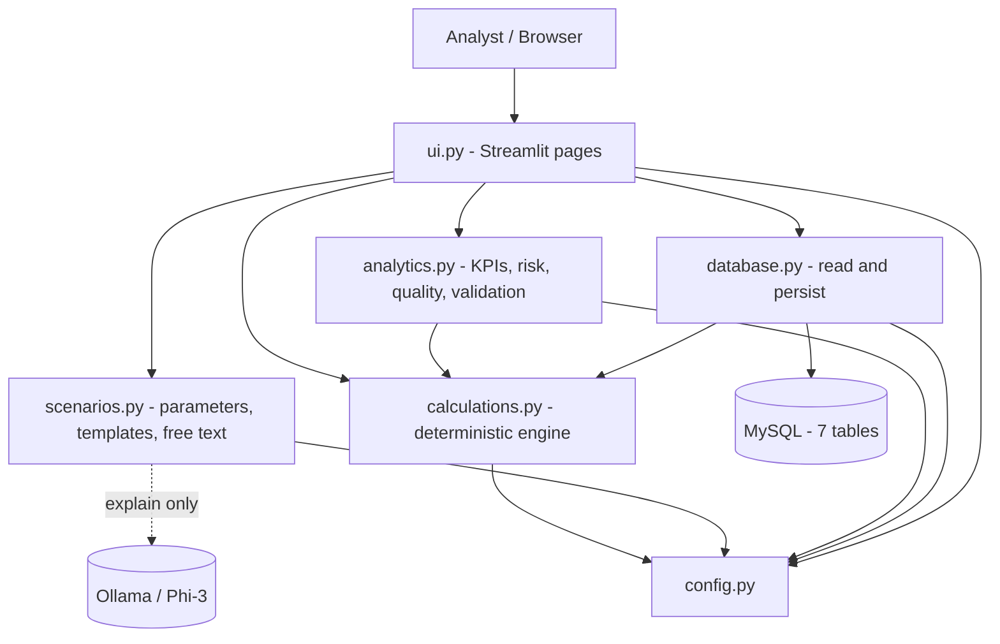
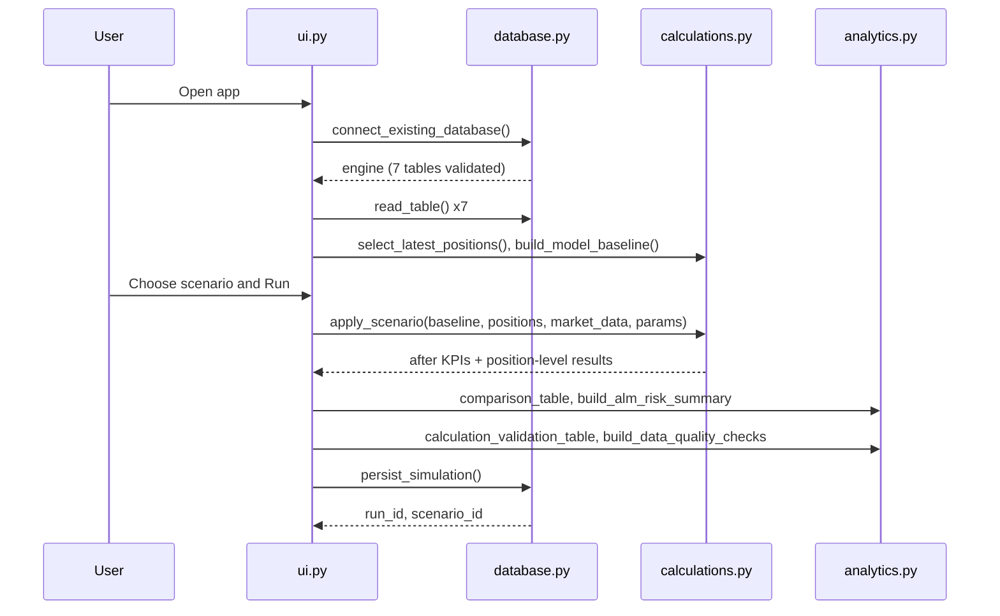
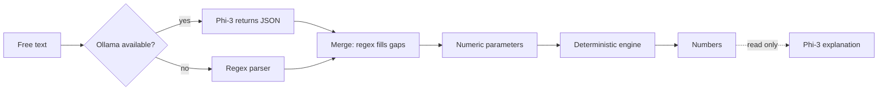

# Architecture

## Layered view

## Module dependencies

`config` is the base and depends on nothing. `calculations` depends only on `config`. `database`, `analytics` and `scenarios` depend on `config` (and `calculations` for the first two). `ui` imports everything. There are no circular imports.

## End-to-end flow of one simulation

## State handling

Streamlit re-executes the script on every interaction. Connection settings, the active template, current scenario parameters and AI output are kept in `st.session_state`. The 7 tables are re-read from MySQL on each rerun (see [Limitations](limitations.md)).

## Local AI boundary

The model only (a) extracts explicit numbers from text and (b) narrates results already computed in Python.
