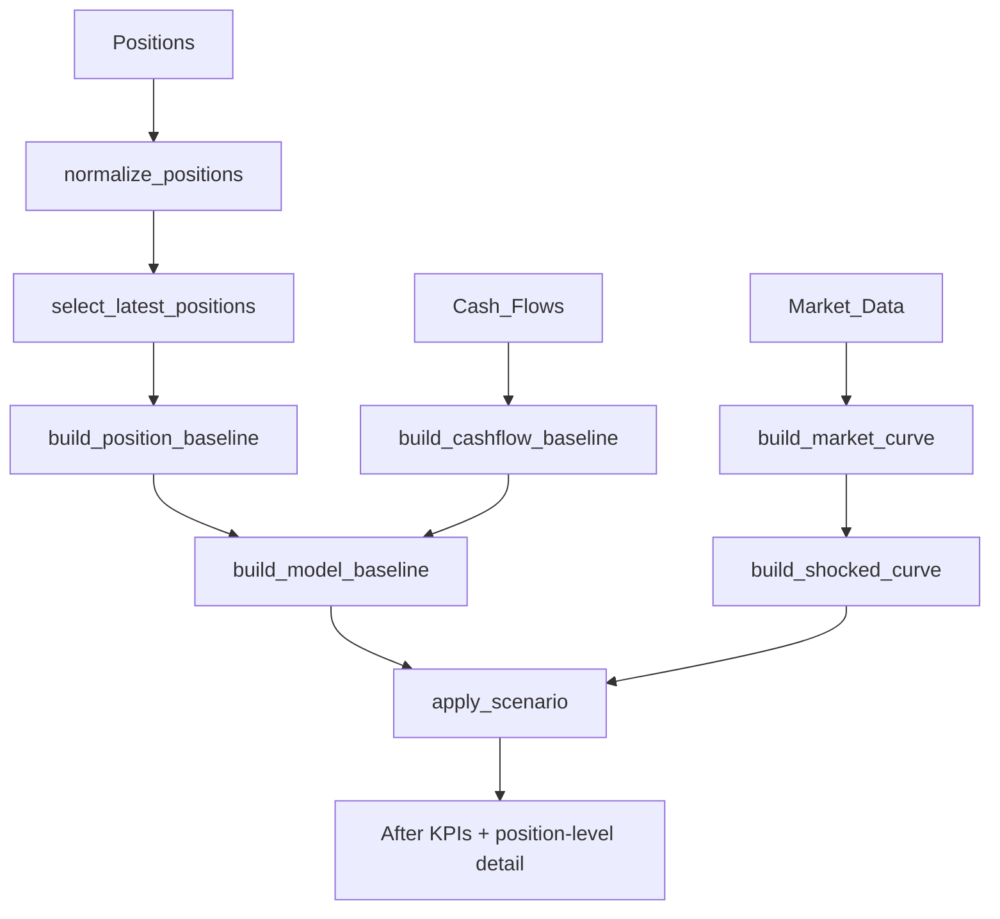

# Calculation Engine (`calculations.py`)

The engine is deterministic: the same inputs always give the same outputs. It uses simple interest on an Actual/365 basis.

## Pipeline

## 1. Baseline

Latest snapshot: positions with the greatest `as_of_datetime` not later than the target date.

$$
\text{Interest}_i = \text{Balance}_i \times \text{Rate}_i \times \frac{\text{Horizon Days}}{365}
$$

| KPI | Formula |
|---|---|
| Interest Income | Loan interest + Investment interest |
| Interest Expense | Deposit interest + Funding interest |
| **NII** | Income − Expense |
| **NIM %** | NII / (Loans + Investments) × 100 |
| **Cost of Funds %** | Expense / (Deposits + Funding) × 100 |
| **Loan/Deposit %** | Loans / Deposits × 100 |
| **Repricing Gap** | Σ balance of repricing-eligible assets − Σ balance of repricing-eligible liabilities |

## 2. Market curve

1. Keep `Market_Data` rows whose `data_type` contains *interest*, *yield* or *rate*.
2. Convert `tenor` strings (`1M`, `3M`, `1Y` …) to days (`D=1`, `W=7`, `M=30.4375`, `Y=365`).
3. Normalize `yield_rate` to a decimal.
4. Keep the latest observation per tenor.
5. Shock the curve in parallel: `shocked = base + shock_bps / 10 000`.
6. Interpolate linearly (`numpy.interp`) at each position's reference tenor.

## 3. Repricing events

A position reprices only if it is *eligible*: floating/variable/adjustable rate types are eligible; fixed and non-interest types are not; otherwise loans, deposits, funding and investments are eligible by category.

Event dates start at `next_repricing_date` (or the simulation date) and repeat every `repricing_frequency` until the end of the horizon or the maturity date, whichever is first (hard cap: 120 events per position).

The **reference tenor** used to read the curve is, in order: the repricing frequency, the days to the next repricing date, the days to maturity (capped at 3 650), or 365.

## 4. Period-by-period interest

For each position:

$$
\Delta r = (\text{curve}_{shocked} - \text{curve}_{base}) \times \frac{\text{pass-through}}{100}
$$

- Before the first event, interest accrues at the current rate.
- After each event, the rate becomes `Before Rate + Δr`.
- `Interest After = Σ balance × rate_period × days_period / 365`.
- `Interest Change = Interest After − Interest Before`.

## 5. Scenario KPIs

$$
\text{NII}_{after} = \text{NII}_{base} + \Delta_{loan} + \Delta_{investment} - \Delta_{deposit} - \Delta_{funding}
$$

Growth parameters scale the reported loan and deposit balances (used by NIM, cost of funds and Loan/Deposit):

$$
\text{Loans}_{after} = \text{Loans}_{base} \times (1 + g_{loan}/100)
$$

## 6. Liquidity (Cash_Flows only)

| Item | Formula |
|---|---|
| Inflow / Outflow | Sum of `total_amount` by `inflow_outflow` |
| HQLA | Sum of `total_amount` where `hqla_flag = 1` |
| Net outflow | max(Outflow − Inflow, 0) |
| **LCR proxy %** | HQLA / Net outflow × 100 |

With a liquidity shift `s %`: inflow × (1 + s), outflow × (1 − s), HQLA × (1 + s).

!!! info "Why it is called a proxy"
    A regulatory LCR uses a 30-day stressed window with run-off factors and a stock of HQLA. Here HQLA comes from flagged cash-flow rows, so the result is an indicator, not a regulatory figure.

## Helper functions

| Function | Purpose |
|---|---|
| `tenor_to_days` | `"3M"` → 91 |
| `normalize_market_yield` | `18.5` or `0.185` → `0.185` |
| `interpolate_curve_rate` | Linear interpolation on the curve |
| `build_repricing_events` | Dates when a position reprices |
| `dynamic_repricing_calculation` | Interest before/after for one position |
| `repricing_fraction` | Share of the horizon after the first repricing (derived, never an input) |
