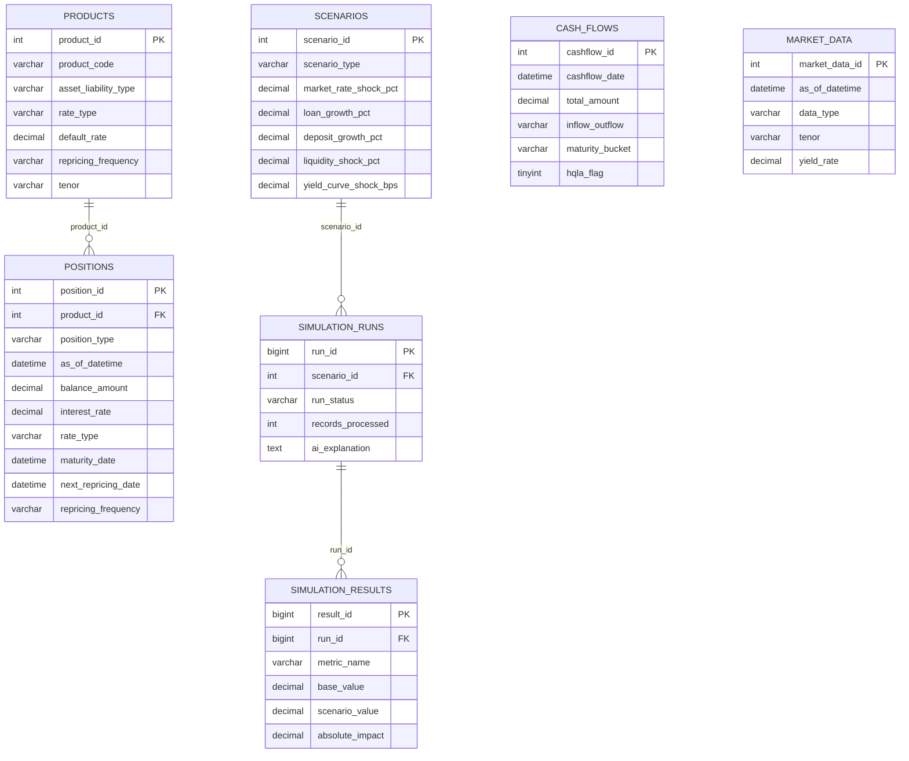
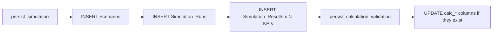

# Database Design

The application uses an **existing** MySQL 8 database, `nbe_alm_simulation`, with 7 tables (InnoDB, `utf8mb4`). `REQUIRED_TABLES` in `config.py` lists them and `connect_existing_database()` fails fast if any is missing.

## Entity relationships

`Cash_Flows` and `Market_Data` are independent reference tables with no foreign keys.

## Table roles

| Table | Role | Used by |
|---|---|---|
| `Products` | Product master (asset/liability type, rate type, repricing frequency) | Normalization, audit |
| `Positions` | Balance and rate snapshots by `as_of_datetime` | NII, NIM, repricing gap |
| `Cash_Flows` | Contractual inflows and outflows with HQLA flag | Liquidity, LCR proxy |
| `Market_Data` | Yield curve points by tenor | Repricing engine |
| `Scenarios` | Saved scenario definitions | Scenario history |
| `Simulation_Runs` | One row per execution | Audit |
| `Simulation_Results` | One row per KPI per run | History, comparison |

## Conventions

- **Rates are decimal fractions.** `Positions.interest_rate = 0.123` means 12.3 %. Never divide by 100.
- **Market yields** may be stored as `18.5` or `0.185`; `normalize_market_yield()` treats any absolute value above 2 as a percentage.
- **Shocks** are entered in percentage points; the curve shock is stored in basis points (`pp × 100`).
- **Position categories** are matched case-insensitively: `loan`, `deposit`, `funding`, `investment`.
- **Amounts** are in EGP (`MODEL_AMOUNT_UNIT`).

## Data-access layer (`database.py`)

| Function | Purpose |
|---|---|
| `connect_existing_database` | Open a connection, run `SELECT 1`, check required tables. |
| `read_table` | Read a table with an explicit, back-ticked column list and a row limit (100 000). |
| `read_sql_df` | Fault-tolerant `pandas.read_sql`; errors are stored in `session_state["db_errors"]`. |
| `get_columns` / `table_exists` | Schema introspection through `information_schema`. |
| `insert_one_get_id` | Insert a row and return `LAST_INSERT_ID()` inside one transaction. |
| `safe_insert_rows` | Bulk insert that keeps only columns that exist in the target table. |
| `persist_simulation` | Save scenario, run and KPI results. |
| `persist_calculation_validation` | Optional write-back of `calc_*` audit columns, when present. |

Persistence is **schema-tolerant**: every insert and update is filtered to columns that actually exist, so the code works against slightly different schema versions.

## Persistence flow

