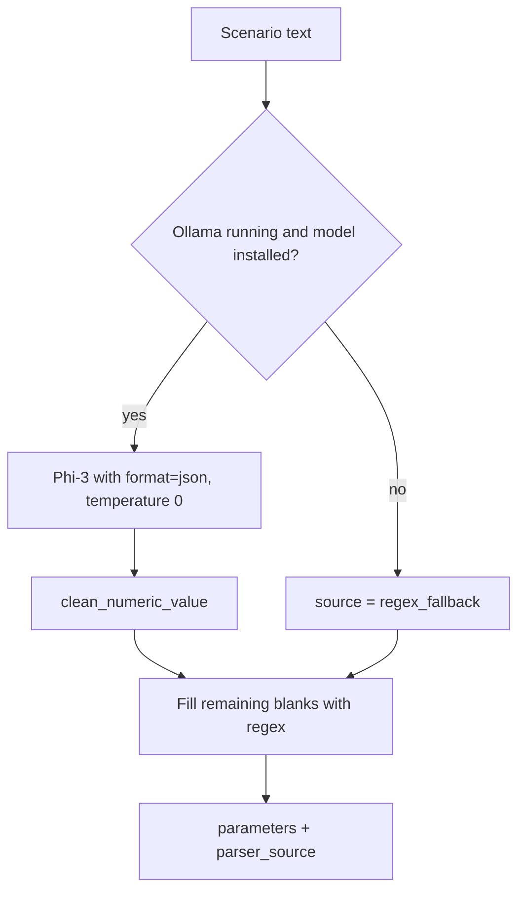

# Scenarios (`scenarios.py`)

## Parameters

| Parameter | Unit | Limit | Meaning |
|---|---|---|---|
| `rate_change_pp` | pp | ±20 | Parallel market-rate shock |
| `loan/deposit/funding/investment_pass_through_pct` | % | 0–200 | Share of the market move passed to client rates |
| `loan_growth_pct`, `deposit_growth_pct` | % | ±100 | Balance growth |
| `liquidity_shift_pct` | % | ±100 | Shift in cash inflows/outflows/HQLA |
| `yield_curve_shock_bps` | bps | ±2000 | Defaults to `rate_change_pp × 100` |

Defaults and limits live in `SCENARIO_DEFAULTS` and `SCENARIO_LIMITS`.

## Four scenario modes

| Mode | Behaviour |
|---|---|
| **Base Case** | No stress; neutral parameters. |
| **Combined Stress** | All eight drivers are editable at once. Template: +3 pp, deposits −5 %, loans +5 %, liquidity −15 %. |
| **Individual Parameter** | One chosen driver (rate, deposit growth, loan growth, liquidity); everything else neutral. |
| **Free Type** | Natural-language description turned into parameters. |

Legacy scenario types stored in the database (`RATE_SHOCK`, `DEPOSIT_GROWTH`, `LOAN_GROWTH`, `LIQUIDITY_STRESS`, `CUSTOM` …) are mapped into these four modes by `resolve_saved_template()` and `build_saved_template_values()`.

## Free-text parsing

- The prompt asks for JSON with a fixed list of allowed keys only.
- `clean_numeric_value` strips commas and converts `bps` to percentage points.
- `extract_parameters_regex` understands English and Arabic keywords, and flips the sign when words such as *decrease*, *drop* or *انخفاض* appear.
- The result reports `parser_source` (`phi3` or `regex_fallback`) so the user knows which path was used.

## Explanation-only AI

`ask_ollama()` sends the already-computed results as JSON and asks the model to explain them, with an instruction not to change or compute numbers. If Ollama is down or the model is missing, a readable message is returned instead of raising an exception.
